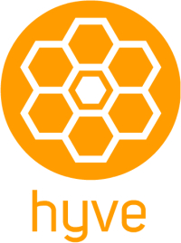

# Hyve
**WINNER** of Startup Weekend New Haven CT at Yale 2014

## Building/small community sharing and alerting platform
"What's buzzin' in your building?"

Hyve is a mobile app that creates more efficient, transparent communication around facilities management. Through location tagging, Hyve helps individuals report issues in large buildings they use daily, such as campuses or workplaces. With Hyve, facilities teams better serve their buildings, community members become actively involved in upkeep of spaces, and building owners resolve issues promptly. Find out what's buzzin' in your building with Hyve.

[Hyve Homepage](http://www.myhyve.co/)

[Hyve Project Page (on Devpost)](http://devpost.com/software/hyve)

The current live demo is [here](http://app.myhyve.co/) 

Video is [here](https://youtu.be/rxkZO4NHeU4)

Copyright (c) 2014 [RKO Security](http://www.rkosecurity.com)
